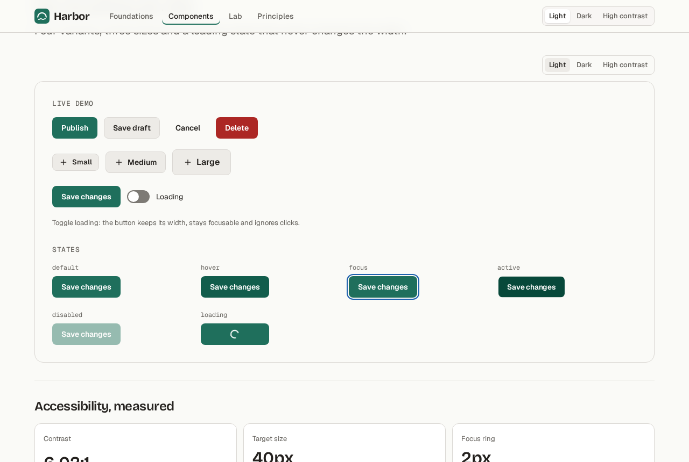
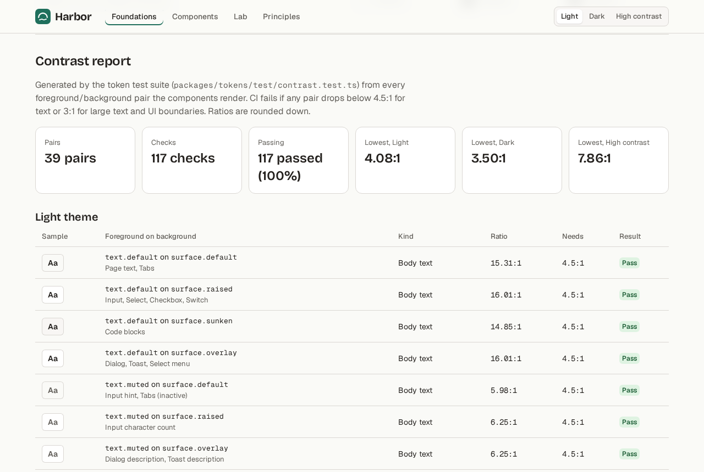
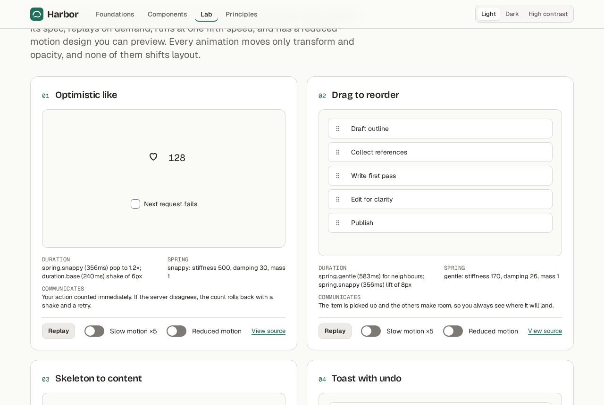
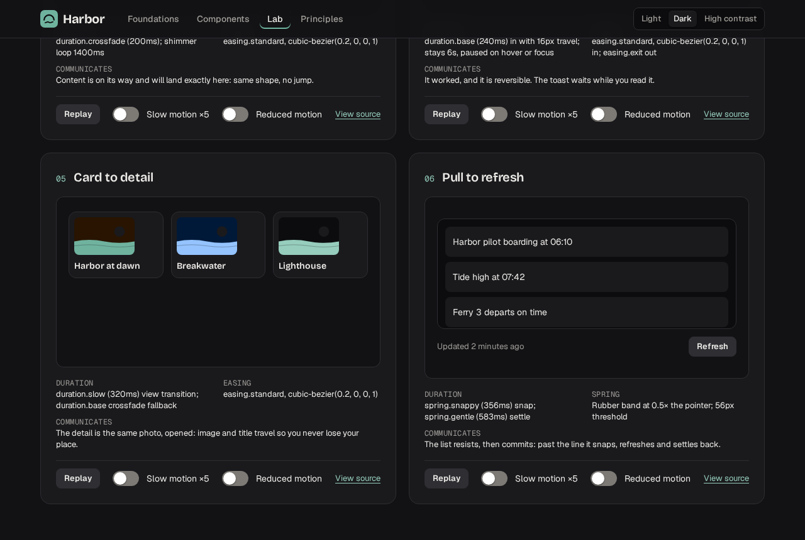

# Harbor UI

**Harbor is a small, accessible, token-driven design system.**

Live: **https://harbor-ui-docs.vercel.app** · Lab: https://harbor-ui-docs.vercel.app/lab ·
Release: [v1.0.0](https://github.com/ianmiyazato/harbor-ui/releases/tag/v1.0.0)

Twelve React 19 components styled only with semantic tokens, three themes that are token mappings
rather than forks, a WCAG contrast matrix computed in CI, and a micro-interaction lab where every
animation has a spec, a slow-motion replay and a reduced-motion design.

## Screenshots

| A component page                                                                                | The generated contrast report                                                               |
| ----------------------------------------------------------------------------------------------- | ------------------------------------------------------------------------------------------- |
|  |  |
| **The micro-interaction lab**                                                                   | **The lab in dark mode**                                                                    |
|                      |       |

## What to look at in 3 minutes

1. **[Button](https://harbor-ui-docs.vercel.app/components/button)**: flip the demo's theme to Dark
   and High contrast, then toggle Loading. The width does not move (Playwright measures it).
2. **[Contrast report](https://harbor-ui-docs.vercel.app/foundations/color#contrast)**: 117 checks,
   rendered from the JSON the token tests write. Nothing on that page is typed by hand.
3. **[Lab](https://harbor-ui-docs.vercel.app/lab)**: turn on _Slow motion ×5_ on Drag to reorder,
   reorder with the keyboard (Space, arrows, Space), then turn on _Reduced motion_ and replay.
4. **[Motion tokens](https://harbor-ui-docs.vercel.app/foundations/motion)**: springs simulated from
   stiffness and damping, compiled to CSS `linear()`, each with its reduced counterpart.
5. **The history**: `git log --oneline develop` shows a `test(...)` commit before every `feat(...)`
   (34 test commits, 25 feat, 3 fixes found by later tests). Rebase merges keep the pairs
   ([ADR 0005](docs/adr/0005-rebase-merges-for-test-first-history.md)).

## Principles

- **States before variants.** Hover, focus, active, disabled, loading and error are where products
  feel cheap or polished. One states registry per component drives the docs, axe and screenshots.
- **Tokens are the API.** Components read 127 semantic tokens and never touch the palette; stylelint
  fails the build on any raw color, size or duration.
- **Accessibility is measured, not claimed.** Contrast computed in CI for every theme, axe on every
  documented state and every page, target sizes measured in the rendered DOM.
- **Motion explains change.** Named durations, easings and springs, each with a reduced-motion
  counterpart; only `transform` and `opacity` animate, and no interaction shifts layout.
- **Small surface, deep quality.** Twelve components, Radix underneath the complex ones, budgets in
  CI, every behavior test-first.

## Architecture

```
                         packages/tokens  (source of truth)
                palette primitives ──► semantic tokens ──► themes: light · dark · hc
                                          │                reduced motion · timescale
          ┌───────────────────────────────┼──────────────────────────────┐
          ▼                               ▼                              ▼
   dist/tokens.css                 dist/index.js + .d.ts          dist/tokens.json
   (CSS variables)                 (typed module)                 dist/contrast-report.json
          │                                                              │
          ▼                                                              │
   packages/react  ── 12 components, CSS Modules on --hb-* only,        │
          │           Radix under Select/Tabs/Dialog/Tooltip/Toast      │
          │           states registries ──► axe tests, docs, screenshots │
          ▼                                                              ▼
   apps/docs (Astro 5, static) ── content pages: 0 JS files ◄── contrast report, props
          │                        component pages: one React island   (generated at build)
          │                        /lab: six islands, client:visible
          ▼
   Vercel Hobby, 1 project, static output, no functions ── https://harbor-ui-docs.vercel.app
```

Decisions and trade-offs: [docs/adr](docs/adr) (5 ADRs) and
[docs/agents/decision-log.md](docs/agents/decision-log.md).

## Quality, measured

All numbers are from real runs on 2026-09-28.

| Area                                   | Result                                                                                                                                                       |
| -------------------------------------- | ------------------------------------------------------------------------------------------------------------------------------------------------------------ |
| Tests                                  | **519 automated**: 311 Vitest (unit, axe per documented state, tokens, infra), 154 Playwright e2e, 54 visual baselines                                       |
| Coverage                               | `packages/react` **97.74%** statements (gate 90%), `packages/tokens` **100%** statements and lines (gate 100%)                                               |
| Mutation                               | Stryker on Button and Dialog: **87.76%** (was 60.00% before the tests it prompted)                                                                           |
| Contrast                               | **39 pairs × 3 themes = 117 checks, 117 passing (100%)**; lowest 4.08:1 light, 3.50:1 dark (UI boundary), 7.86:1 high contrast                               |
| Lighthouse (CI, median of 3, mobile)   | Home, Button page, Lab: **100** performance, accessibility, best practices and SEO                                                                           |
| Lighthouse (local, all 11 pages at M4) | performance 99–100, accessibility / best practices / SEO 100                                                                                                 |
| Bundle (gzip, size-limit in CI)        | Button **0.64 kB**; 7 core components 2.84 kB; styles 4.39 kB; full package with Radix 45.07 kB (target was 35 kB, see [D-020](docs/agents/decision-log.md)) |
| Page JS (gzip)                         | content pages load no JS files (≤ 0.5 kB inline); a component page 74 kB (React runtime + demo); `/lab` 95.4 kB (65.9 kB of it is the React/Astro runtime)   |
| Motion                                 | every lab animation is transform/opacity only and CLS 0 (checked by e2e); 0 frames over 50 ms unthrottled ([docs/perf/lab.md](docs/perf/lab.md))             |
| Deploys                                | 2 production deploys so far (M4, M5) of a 5-deploy budget; this release is the third. 0 previews, 1 project, 0 functions                                     |

Known gaps are listed honestly in [AGENTS.md](AGENTS.md#known-gaps): the full-package and lab JS
targets are missed because of Radix and the React runtime, not hidden.

## Run it locally

Requires Node 22 and pnpm 10.

```bash
pnpm install
pnpm dev            # docs site at http://localhost:4321
pnpm check          # lint, typecheck, unit + a11y tests, build
pnpm build && pnpm preview   # the production build, which every browser test targets
pnpm test:e2e       # Playwright against the local production build
pnpm test:visual    # visual regression
pnpm size           # size budgets
pnpm test:coverage  # coverage with thresholds
pnpm mutation       # Stryker on Button and Dialog
```

Using the packages in an app:

```tsx
import '@ianmiyazato/harbor-tokens/tokens.css';
import '@ianmiyazato/harbor-react/styles.css';
import { Button } from '@ianmiyazato/harbor-react';

<Button variant="primary">Publish</Button>;
```

MIT © Ian Miyazato. Built as portfolio evidence; see also the systems portfolio at
https://ian-portfolio-shell.vercel.app/.
